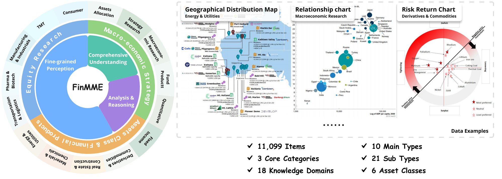

FinFusion – Fusion benchmark for financial multi-modal tasks

[](https://huggingface.co/datasets/luojunyu/FinMME)
[](https://github.com/luo-junyu/FinMME)
[](https://opensource.org/licenses/MIT)

## 🔥 Overview

Paper Link: [Arxiv](https://arxiv.org/abs/2505.24714).

**FinMME** is a comprehensive benchmark dataset designed to evaluate Multimodal Large Language Models (MLLMs) in the financial domain. With around **11,000 high-quality financial samples** spanning **18 financial domains** and **6 asset classes**, FinMME provides a rigorous evaluation framework for financial multimodal reasoning capabilities.




## 🚀 Quick Start

### Installation

```bash
git clone https://github.com/luo-junyu/FinMME.git
cd FinMME
pip install -r requirements.txt
```

### Dataset Loading

```python
from datasets import load_dataset

# Load the dataset
dataset = load_dataset("luojunyu/FinMME", split="train")

# Access a sample
sample = dataset[0]
print(f"Question: {sample['question_text']}")
print(f"Answer: {sample['answer']}")
print(f"Question Type: {sample['question_type']}")
```

### Running Evaluation

```bash
# Basic test
python eval.py --sample_size 50 --num_processes 32

# Full evaluation
python eval.py 

# Custom evaluation
python eval.py --sample_size 100 --num_processes 16
```

#### Evaluation Parameters

- `--dataset`: Dataset name (default: `luojunyu/FinMME`)
- `--split`: Dataset split (default: `train`)
- `--sample_size`: Number of samples to evaluate (default: all)
- `--num_processes`: Number of parallel processes (default: 4)

### Configuration

Before running evaluation, configure your API settings in `eval.py`:

```python
model = "gpt-4o"  # Your model choice
api_key = 'YOUR_API_KEY'  # Your OpenAI API key
base_url = 'https://api.openai.com/v1'  # API endpoint
```

## 🏗️ Dataset Structure

### Question Types
- **Single Choice**: Multiple choice questions with one correct answer
- **Multiple Choice**: Questions with multiple correct answers
- **Numerical**: Calculation-based questions requiring numerical answers

### Financial Domains
- TMT (Technology, Media & Telecom)
- Consumer Goods
- Pharmaceuticals & Biotechnology
- Financial Services
- Real Estate & Construction
- Energy & Utilities
- And 12+ more specialized domains

### Asset Classes
- Equity
- Foreign Exchange
- Rates
- Commodity
- Credits
- Cross-Asset

## 🎯 Evaluation Methodology

### FinScore Calculation

FinScore combines domain-normalized performance with hallucination penalties:

```
FinScore = Domain_Normalized_Score × (1 - Hallucination_Penalty)
```

### Multi-dimensional Assessment

1. **Comprehensive Perception**: Temporal sequence recognition, multi-chart analysis
2. **Fine-grained Perception**: Numerical extraction, local variation analysis  
3. **Cognition & Reasoning**: Data inference, trend prediction, causal analysis


## 📚 Citation

If you find FinMME useful, please consider citing:

```bibtex
@article{luo2025finmme,
  title={FinMME: Benchmark Dataset for Financial Multi-Modal Reasoning Evaluation},
  author={Luo, Junyu and Kou, Zhizhuo and Yang, Liming and Luo, Xiao and Huang, Jinsheng and Xiao, Zhiping and Peng, Jingshu and Liu, Chengzhong and Ji, Jiaming and Liu, Xuanzhe and others},
  journal={arXiv preprint arXiv:2505.24714},
  year={2025}
}
```
